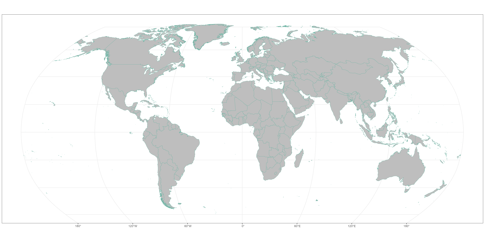

# un_world_map

# Minimum package for creating UNIGME world map with the UN boundaries

The source shape files were from 2012 and has been used until now.

# Folders:

-   shp: raw shape files
-   data: processed shape files loaded as rds
-   R: R functions to load the data
-   code: script to produce the map used in UNIGME report: use "code/_world map of mortality rates.R"


# Example

Plot Robinson projection

```         
library("ggplot2")
library("sf")

shp_file_dir <- file.path("shp/un-world-2012-no-antartica-10pct.shp")
geo <- sf::st_read(shp_file_dir)
geo <- sf::st_transform(geo, crs = "+proj=robin")  # convert to Robinson projection

ggplot(data = geo) +
  geom_sf(fill = "grey", color = "#69b3a2") +
  theme_bw() + coord_sf()
```


